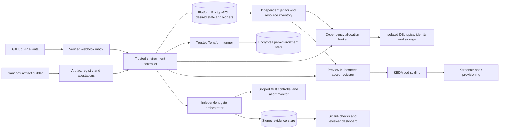
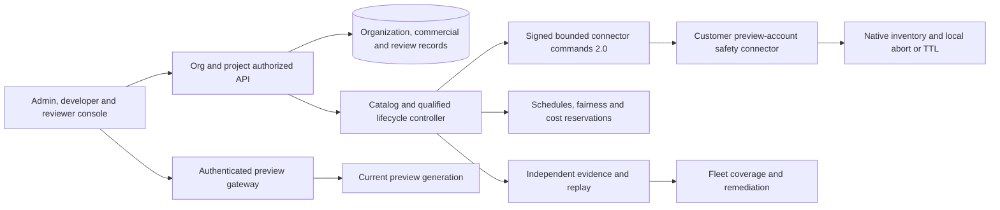

# Architecture

## 1. Topology

## 2. Control plane

Use a Go reconciliation controller backed by PostgreSQL. Controllers claim environment/action leases, compute bounded transitions from desired versus observed state and persist an action before executing external mutations. A webhook inbox deduplicates events. All actions/resources have stable IDs and candidate generation. Database fencing prevents stale controller commits; external mutation serialization handles systems that cannot accept a fencing token.

The controller does not execute PR source. Trusted runner images and catalog modules come from protected platform releases. Candidate images run only after recipe/provenance/resource checks inside the preview sandbox. Separate identities own build, provision, deploy, test, experiment, cleanup and report publication.

## 3. Foundation versus environments

Foundation Terraform provisions the preview AWS account boundary, VPC/EKS, shared durable dependencies, registry/state/evidence stores, KMS, identity/egress, KEDA and Karpenter. Only platform operators/pipelines mutate foundation state.

Per-environment Terraform owns bounded cloud bindings and resource declarations using immutable modules. A typed allocation broker creates dedicated bounded preview PostgreSQL/Redis instances and roles, quota-enforced Kafka topics/ACLs/groups, qualified Temporal namespaces/authorization, object scopes and OIDC clients. Reviewed internal shared-data profiles are optional; untrusted previews do not rely on logical DB/key names for resource isolation. The broker holds necessary dependency-admin credentials; it accepts platform-generated environment IDs and constrained requests, not arbitrary SQL/policy text.

Kubernetes namespace/policy/secrets/deployments are installed through platform-owned templates. Candidate code supplies no arbitrary Terraform provider, shell provisioner or Helm hook. Preview migration code is allowed to alter only its allocated database, using an environment-local migration identity with no global role/database creation privileges.

## 4. Privilege boundaries

Untrusted builds run in a separate ephemeral builder execution boundary without cloud OIDC, platform GitHub token or privileged Docker socket. Builder and candidate workloads never run on controller, allocator, runner, signer or cleanup nodes. Provenance identifies what was built; signatures do not make candidate code safe.

All pull-request runtime code is treated as potentially malicious, including same-organization branches. `preview-small` MUST select an explicit qualified sandbox `RuntimeClass` (initial candidate: Kata Containers/microVM; an independently qualified equivalent may substitute), restricted/nonroot/seccomp/LSM policy and dedicated tainted preview worker pool with no useful cloud instance identity. Silent fallback to ordinary `runc` on missing runtime support is denied. Unsupported syscalls/resources fail admission with an actionable explanation. Separate cloud account and node privilege boundary contain workload/node risk; namespace/network policy alone is not treated as a container-escape boundary. Test runtime isolation and deliberate exhaustion/noisy-neighbor behavior. The first launch requires a successful version-pinned prototype; otherwise hostile PR previews remain unavailable while trusted, reviewed candidates use their explicitly approved profile. The customer-facing trust profile states what is and is not contained.

The trusted provisioning workflow comes from the protected platform/default branch. Cloud OIDC conditions restrict issuer, repository, approved workflow identity/environment and intended audience. Never use `pull_request_target` to checkout/run PR code with write credentials. Fork previews require an explicit admitted sandbox path and may have lower quotas/no external egress.

Preview cluster/account is separate from production. A dedicated experiment cluster/node pool contains privileged fault capabilities; ordinary previews use narrowly scoped pod faults and per-preview egress proxies. External integrations and model calls use controlled stubs unless a separately authorized profile supplies capped preview credentials.

No candidate executes with node IAM/instance-profile credentials; provider metadata endpoints are blocked outside pod policy as defense in depth, and node roles are limited to cluster infrastructure. Sandbox runtime admission is fail-closed and checked by independent evidence. A node/runtime escape must not expose signing, platform SaaS DB, production accounts or sibling encryption keys. Cluster/account isolation does not remove kernel/runtime risk; use the qualified isolation class and publish its threat boundary.

## 5. Reconciliation and resource ownership

Environment desired state contains candidate/config/recipe generation and expiry. Provisioning proceeds in bounded phases: admission/reservation, identity allocation, dependencies, runtime policy, migration/seed, rollout, health, gates, ready. Teardown reverses dependency references after stopping workload ingress/claims and revoking secrets.

Every external action has a stable idempotency key and resource ownership entry. On timeout, observe the external resource before retrying; failure to receive a response is not proof that creation failed. Terraform plan/apply/destroy for one environment is serialized, state-locked and cannot overlap a replacement runner until the previous process and provider operations are accounted.

Independent janitor inventories ownership tags and provider-native identifiers. It reconciles missing ledger rows, stale environments and partial cleanup. Resource reference counts protect shared infrastructure. Destroy never targets a shared resource because one preview is closed.

## 6. Test and experiment orchestration

Gate orchestrator deploys independent harnesses outside candidate code's trust boundary. Candidate health/metrics are inputs, not proof. The harness sends requests, checks data isolation and records externally observed effects through trusted seed identities, scoped database audit readers, mock providers and receivers.

Experiments have explicit environment/generation, selector, allowed fault type, magnitude/duration, blast radius, abort thresholds, recovery deadlines and policy digest. Independent watchdog can remove faults and halt traffic without relying on candidate app code. Missing watchdog/readiness/observations blocks experiment start.

Per-preview faults target its pods or client-side proxy paths. Killing shared PostgreSQL/Kafka/Temporal infrastructure requires a dedicated environment that owns those resources and a separately authorized infrastructure profile. Chaos Mesh privileges and network fault daemon reach are constrained to the experiment infrastructure; a namespace selector by itself is not enough to reduce privilege risk.

## 7. Scaling and cost

KEDA scales Keel consumer/receiver pods based on Kafka lag and executor pods based on runnable DB work; Karpenter scales schedulable worker-node capacity. Workload replica/connection/provider caps remain enforced independently. Foundation stateful services/ingress do not scale to zero.

Cost/reservation policy caps concurrency and node capacity before provisioning. Spot capacity is preferred for resumable workers, with on-demand fallback under an approved reserve. Stateful services and required control/ingress capacity use reliable baseline placement. Separate fleet-fixed cost, preview-variable cost, experiment cost and external-provider spend.

## 8. Production deployment relationship

Ghostlight's preview control plane cannot directly mutate production. It emits a signed evidence bundle for a candidate. A separate production pipeline verifies exact digests/policy and performs authorized rollout using production credentials. Future multi-product support uses the same reviewed recipe contract; it does not loosen catalog/trust constraints.

## 9. SaaS, reviewer and fleet architecture

Add modules within the protected platform Go application: `organizations/identity/commercial`, `projects/catalog`, `review/access`, `fixtures/schedules`, `comparisons/replay`, and enterprise `connectors/governance/coverage/campaigns`. PostgreSQL owns organization/resource grants and current entitlements; customer-facing queries use organization RLS plus project/resource ACL. Controller/allocator/janitor system roles retain constrained native safety duties; customer owners cannot assume those roles.

Run a scoped `saas-worker` for billing/notification/support/import/export intent processing, separate from runner/signing/allocator credentials. Run `preview-gateway` with only current route/access policy reads, short-lived session validation and approved preview upstream egress, no state/secret/signing privileges. The frontend/API owns customer and reviewer workflows. Billing provider/email/chat/issue integrations use signature-verified inbox and durable outbox with independent secrets/rate budgets.

Hosted execution is the default. Enterprise local connectors require the separate failure-domain and uncertain-operation contract in PRODUCT-SPEC.md; target-cluster tags are not autonomous TTL deletion and do not count as native cleanup proof.

Template/fixture/schedule changes carry immutable provenance and generation effects. Suspension is orthogonal to lifecycle and preserves resource ownership, TTL and explicit retained costs. Enterprise connector moves execution into a customer preview account, with signed bounded commands and offline safety; it does not expose a general shell/cloud API or reuse production credentials. Fleet scorecards measure evidence coverage/freshness and never replace critical invariant checks. Each additional topology and feature set requalifies native cleanup, restore, isolation, capacity and cost.
